# MaaCare Platform — Advanced Architecture

This document describes the **as-built** architecture of the **maacare-platform** monorepo: Next.js (App Router), Supabase (Auth, Postgres, RLS, Storage, Realtime), multi-provider LLM chat with RAG, and supporting domains (community, vitals, symptoms, planner, admin).

---

## 1. System context (who talks to whom)

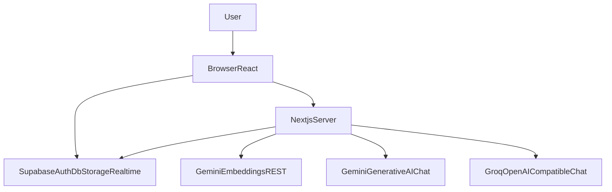

- **Browser** runs the React client (including `createSupabaseBrowserClient` for auth-aware operations and **Realtime** subscriptions). The browser **does not** call Gemini or Groq directly; only **Next.js Route Handlers** hold API keys.
- **Next.js** server handles Route Handlers under `src/app/api/**`, server components, and `proxy` (see `src/proxy.ts`) for cookie session refresh and route gating.
- **Supabase** is the system of record: Auth, Postgres, Row Level Security, Storage buckets, optional **Realtime** publication on selected tables.
- **Gemini** is used for **chat completion** (`@google/generative-ai`), **embeddings** (REST `text-embedding-004` style, see `src/lib/gemini/embeddings.ts`), and a small **multilingual prep** call before RAG (`prepareMultilingualChatTurn` in [`src/lib/chat/multilingual-prep.ts`](src/lib/chat/multilingual-prep.ts) via `generateTextWithGeminiGroqFailover`).
- **Groq** (`https://api.groq.com/openai/v1/chat/completions`) is the **OpenAI-compatible fallback** when Gemini chat fails or returns empty text, using the same system/user envelope where possible (`src/lib/gemini/text-failover.ts`).

---

## 2. High-level containers

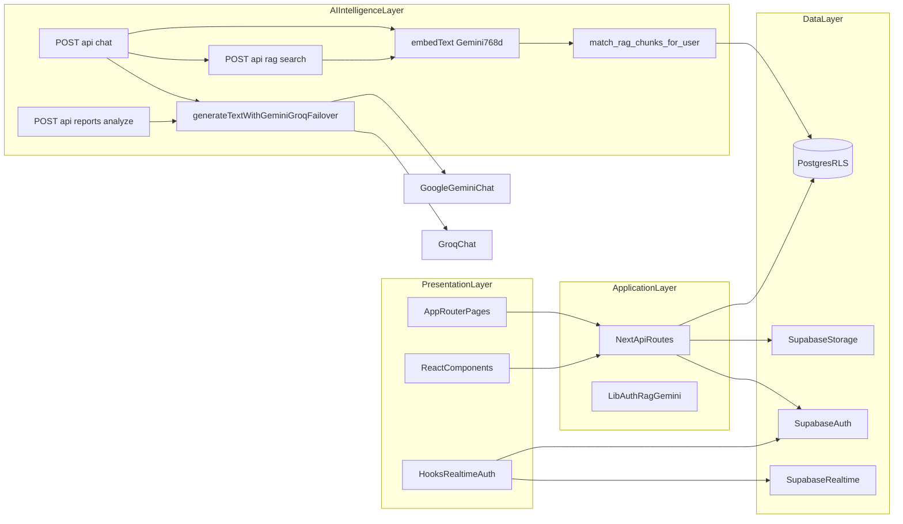

---

## 3. Request path and security boundary

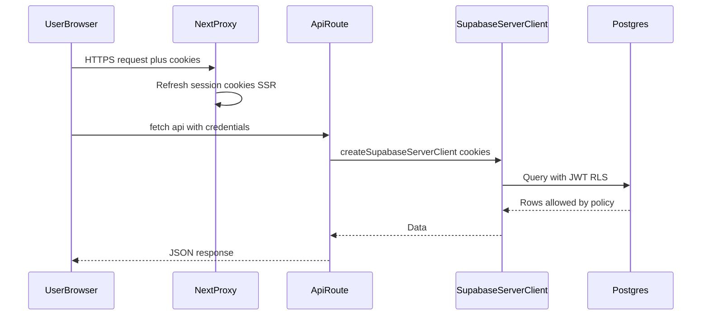

- **`getSessionFromCookies`** (see `src/lib/auth/get-session.ts`) is the gate for protected APIs.
- **RLS** enforces tenant isolation on almost all user tables; admin routes use a **service-role gate** pattern where applicable.
- **Auth roles on `profiles`:** `PATCH /api/profile` accepts only the allowlisted profile fields in `src/app/api/profile/route.ts`. The JSON body must **not** include `role`, `moderator`, or `verified_professional` (those keys are ignored by the schema and are not written from this route). New accounts receive `role = user` from the database default; **moderator** and **admin** are assigned only through admin surfaces (for example `src/app/admin/users/[userId]`), not from public signup or profile self-service.

---

## 4. Frontend map (App Router)

Major **user-facing** surfaces (non-exhaustive):

| Area | Routes / entry | Role |
|------|----------------|------|
| Marketing / entry | `/`, `/login`, `/signup`, `/forgot-password`, `/reset-password`, `/verify-otp`, `/auth/callback` | Acquisition, PKCE auth |
| App shell | `/app` | Logged-in home |
| AI assistant | `/chat` | LLM conversation UI |
| Profile | `/profile`, `/profile/edit`, `/settings`, `/help` | Identity, prefs, Bangla |
| Health | `/vitals`, `/symptoms`, `/symptoms/result`, `/appointments`, `/planner`, `/postpartum` | Structured data capture |
| Community | `/community`, `/community/create`, `/community/[postId]`, `/community/member/[userId]` | Social, threaded replies |
| Safety | `/emergency`, `/facilities`, `/guidance/[topic]` | Information / wayfinding |
| Reports | `/reports` | Document analysis flow (separate API stack) |
| Notifications | `/notifications` | In-app list |
| Admin | `/admin`, `/admin/users`, `/admin/knowledge`, `/admin/community`, `/admin/feedback`, `/admin/settings` | Operations, RAG corpus |

**Shared UI:** `AppShell`, `AppHeader`, `BottomNav`, `NotificationBell` (Sheet + Realtime-driven refresh patterns where enabled).

---

## 5. API surface (Route Handlers)

Grouped by concern:

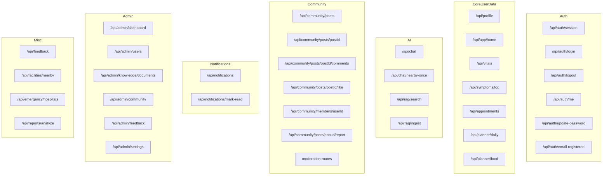

---

## 6. AI chat, RAG, multilingual, and voice (full pipeline)

Primary implementation: **`POST /api/chat`** in [`src/app/api/chat/route.ts`](src/app/api/chat/route.ts). Supporting modules: [`src/lib/rag/service.ts`](src/lib/rag/service.ts), [`src/lib/gemini/embeddings.ts`](src/lib/gemini/embeddings.ts), [`src/lib/gemini/text-failover.ts`](src/lib/gemini/text-failover.ts), [`src/lib/chat/multilingual-prep.ts`](src/lib/chat/multilingual-prep.ts), [`src/lib/bd-facilities/chat-nearby-context.ts`](src/lib/bd-facilities/chat-nearby-context.ts).

### 6.1 Sequence: one chat turn (happy path)

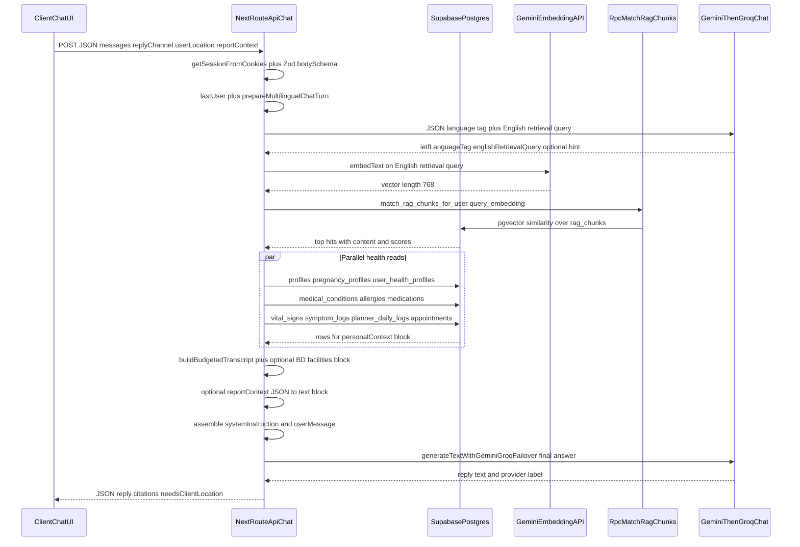

### 6.2 Flow: retrieval, context, and generation

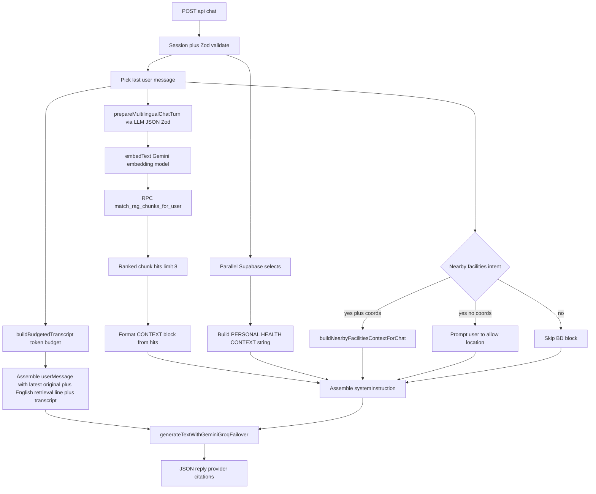

### 6.3 Multilingual behavior (any language in, English RAG, reply in user language)

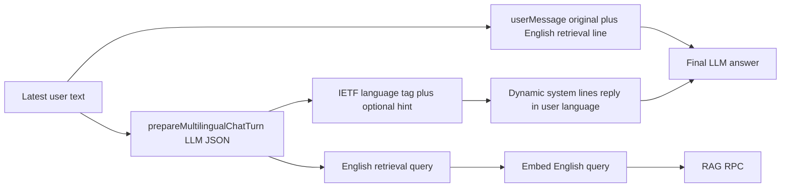

**Implementation details:**

- **Prep step:** [`prepareMultilingualChatTurn`](src/lib/chat/multilingual-prep.ts) calls **`generateTextWithGeminiGroqFailover`** once with a JSON-only contract: **`ietfLanguageTag`** (BCP-47), **`englishRetrievalQuery`** (concise English for embedding over the English-only corpus), optional **`languageHintForPrompt`**. The immediately prior **assistant** snippet (when present) is passed in to disambiguate very short user replies. Optional **`profiles.language`** (`en` / `bn`) is a **tie-breaker** for ambiguous short replies; **`applyReplyLanguageOverrides`** then corrects obvious mismatches (e.g. Latin-script English mis-tagged as Bangla, or Bengali script forcing Bangla).
- **Nearby facilities intent:** [`detectNearbyFacilitiesIntent`](src/lib/bd-facilities/chat-nearby-context.ts) runs on **both** the original latest user message and the **English retrieval query**; results are merged with [`mergeNearbyIntents`](src/lib/bd-facilities/chat-nearby-context.ts) so non-English questions still match after translation.
- **Validation / fallback:** Response is parsed with **Zod**; on failure the server falls back to **`en`** and uses the **raw** latest user message as the retrieval string so chat never hard-fails.
- **Retrieval:** `searchKnowledge` always embeds the **English retrieval query**; chunk text in Postgres remains English.
- **Final model:** `systemInstruction` tells the model to answer in the detected language while **CONTEXT** stays English; `userMessage` includes **original** latest turn plus the **English retrieval query** so intent is grounded without mentioning pipeline steps in the reply. A **BOUNDARIES** block covers harmful or off-topic requests calmly in the same reply language.

### 6.4 Voice channel (`replyChannel: "voice"`)

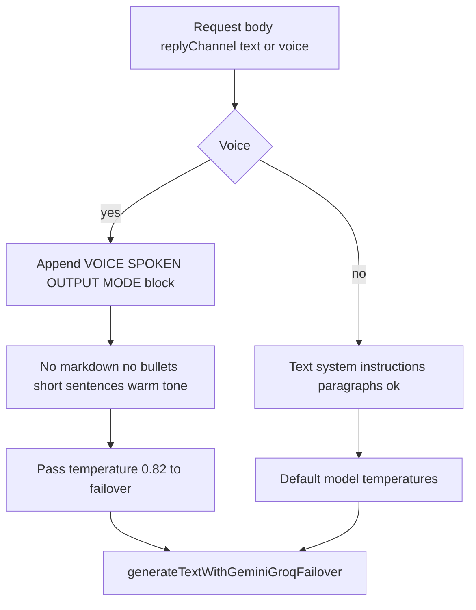

- **Schema:** `replyChannel` is `z.enum(["text", "voice"]).default("text")` on the chat route.
- **Prompting:** Extra system lines forbid markdown and encourage **one to three short sentences** suitable for TTS; acknowledges-only turns get a **single short line** policy.
- **Sampling:** Voice path passes **`temperature: 0.82`** into `generateTextWithGeminiGroqFailover` for slightly more varied spoken phrasing; text mode uses provider defaults unless overridden.

**Client-side voice:** Speech capture, playback, and any browser TTS live under `src/lib/voice/*` and chat UI components (not duplicated here); the **server contract** is the same `POST /api/chat` with `replyChannel: "voice"`.

### 6.5 Models and environment knobs

| Role | Default / typical | Config |
|------|-------------------|--------|
| **Chat completion (primary)** | `gemini-2.5-flash` | `GEMINI_CHAT_MODEL` (`getChatModelName` in `text-failover.ts`) |
| **Chat completion (fallback)** | `llama-3.1-8b-instant` on Groq | `GROQ_CHAT_MODEL` |
| **Embeddings for RAG** | `text-embedding-004`, **768-D** vector stored in Postgres | `GEMINI_EMBEDDING_MODEL` (`embeddings.ts`) |
| **RAG match RPC** | `match_rag_chunks_for_user` | Defined in Supabase SQL migrations; called from `searchKnowledge` |

### 6.6 Provider failover (chat and multilingual prep)

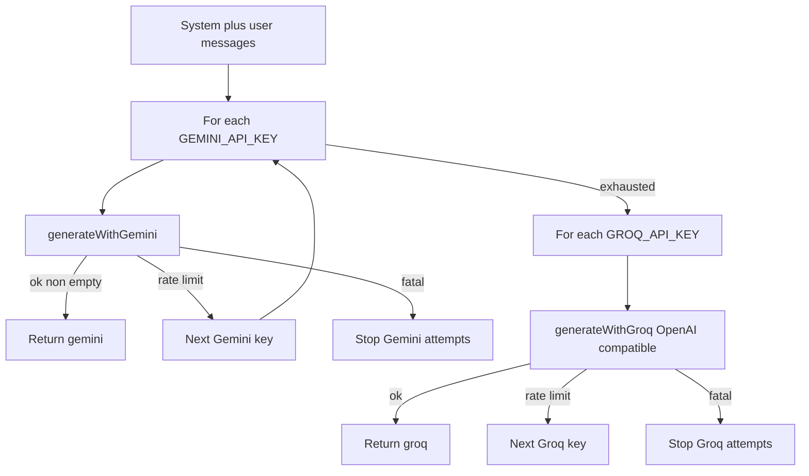

- **Gemini keys:** Tried in order; **429 / quota** errors continue to the next key; other errors can short-circuit the Gemini loop (see `generateTextWithGeminiGroqFailover`).
- **Groq keys:** Same pattern after all Gemini attempts fail or return empty.
- **Same helper** powers the **full chat answer** and the **multilingual prep** JSON step (language tag + English retrieval query), so operational behavior (keys, models, limits) stays consistent.

### 6.7 Context, safety, and budgets

- **Transcript:** `buildBudgetedTranscript` walks messages **newest-first**, clipping each message to `MAX_MESSAGE_CHARS_IN_TRANSCRIPT` and stopping when estimated tokens exceed `MAX_TRANSCRIPT_TOKENS` (heuristic `chars / 4`).
- **Personal block:** Concatenates DOB-derived age, pregnancy week and risk flags, latest vitals and symptom log summaries, recent planner and appointment strings, conditions, allergies, meds, and notes — all from **RLS-scoped** `select` calls under the user id.
- **RAG context:** Up to **8** chunks; formatted with numbered sources; empty hit list still yields an explicit “no internal articles” instruction so the model answers conservatively.
- **Report handoff:** Optional `reportContext` JSON is parsed server-side into a **REPORT CONTEXT** block (title, summary, findings, recommendations) when the user navigates from the reports flow.
- **Bangladesh facilities:** `detectNearbyFacilitiesIntent` on the latest user text; if intent matches and `userLocation` is present, `buildNearbyFacilitiesContextForChat` queries the **BD catalog** in Supabase; otherwise the model is instructed to ask for **location permission** once (`needsClientLocation` in the JSON response).

---

## 7. Knowledge (RAG) subsystem

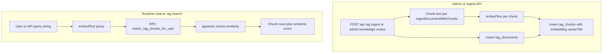

- **Tables:** `rag_documents`, `rag_chunks` (column `embedding` aligned with **pgvector** / `GEMINI_EMBEDDING_DIMENSIONS` = 768), created and indexed via `supabase/migrations/`.
- **Service layer:** [`src/lib/rag/service.ts`](src/lib/rag/service.ts) — `ingestKnowledgeChunk`, `ingestDocumentWithChunks`, **`searchKnowledge`** (embeds query, calls **`match_rag_chunks_for_user`** with `match_count`, `min_similarity`, optional `filter_categories`).
- **Admin HTTP:** `src/app/api/admin/knowledge/documents/**` for CRUD / batch operations (gated by admin role).
- **User search API:** `POST /api/rag/search` — authenticated semantic search over the same RPC stack (for tools and future UI outside chat).

### 7.1 Related: medical report analysis pipeline (separate from live chat RAG)

- **Routes:** `POST /api/reports/analyze`, `POST /api/reports/extract-local` — document upload / OCR style flows with their own prompts and provider usage (see route sources under `src/app/api/reports/`).
- **Chat bridge:** Analyzed report payloads may be passed into **`POST /api/chat`** as `reportContext` so the assistant can discuss the same structured summary inside the normal chat guardrails.

---

## 8. Community domain

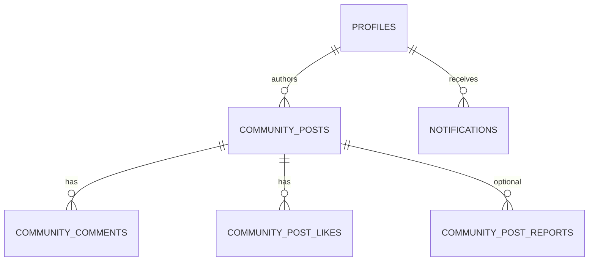

- **Feed & CRUD:** `/api/community/posts` with search, sort, `forYou` hints.
- **Threaded comments:** `parent_comment_id` tree built client-side; post detail uses **`CommunityCommentThread`** component.
- **Likes:** `community_post_likes` + triggers for optional author notifications.
- **Moderation:** RPCs / routes for moderators hiding posts or comments.
- **Member profiles:** `/api/community/members/[userId]` — public-safe fields; pregnancy snippet when **`community_show_extended_profile`** + RLS policy allows read.
- **Realtime (optional):** `postgres_changes` subscriptions in `src/hooks/use-*-realtime.ts` after tables are added to **`supabase_realtime`** publication (migration `20260516120000_*`).

---

## 9. Notifications

- **Table:** `notifications` (kinds e.g. community reply / like / system / reminder).
- **Authoring:** SQL triggers on `community_comments` / `community_post_likes` insert into `notifications` for post authors (see migrations `20250515000000_*`, `20250517000000_*`).
- **API:** `GET /api/notifications`, `POST /api/notifications/mark-read` (per-id or `all: true`).
- **Client:** `NotificationBell` (full-height Sheet), `NOTIFICATIONS_UPDATED_EVENT` for cross-component refresh.

---

## 10. Data model (Postgres — conceptual clusters)

**Identity & profile**

- `profiles` (display, role, language, avatar, prefs, `community_show_extended_profile`, …)
- `auth.users` (Supabase managed)

**Health & journey**

- `pregnancy_profiles`, `user_health_profiles`, `vital_signs`, `symptom_logs`, `appointments`, `planner_daily_logs`, …

**Community**

- `community_posts`, `community_comments`, `community_post_likes`, `community_post_reports`, …

**AI knowledge**

- `rag_documents`, `rag_chunks` (+ vector index via pgvector extension in schema)

**Ops**

- `app_feedback`, admin feature flags, etc.

**Storage buckets (examples)**

- Avatars, community post images (see `supabase/migrations/*storage*.sql`).

---

## 11. Client ↔ Supabase Realtime

When enabled in DB and wired in UI:

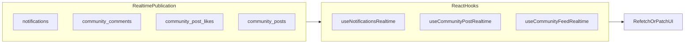

RLS still applies: clients only receive changes for rows they could `SELECT` with the current JWT.

---

## 12. Admin plane

- **UI:** `src/app/admin/**` — dashboard, users, knowledge corpus, community moderation queue, feedback inbox, settings.
- **API:** `/api/admin/**` — uses **elevated** access pattern (service role or role checks via `lib/admin` patterns) — always server-side.
- **User moderation:** community reports, ban/confirm email flows under `api/admin/users/...`.

---

## 13. Cross-cutting concerns

| Concern | Implementation |
|---------|----------------|
| Validation | **Zod** on API bodies (`route.ts` files) |
| Errors | `failJson`, `serverErrorJson`, `validationJsonResponse` (`src/lib/api/error-response.ts`) |
| Theming | `src/lib/theme.ts` (localStorage + `document.documentElement.classList`) |
| Voice | `src/lib/voice/*`, `VoiceCallPanel`; chat **`replyChannel: "voice"`** on `POST /api/chat` (spoken-style system prompt + higher temperature) |
| i18n prefs | Profile `language` `en` \| `bn` + UI copy patterns |
| Mobile UX | Touch targets, `touch-manipulation`, safe-area insets, bottom nav |

---

## 14. Deployment topology (typical)

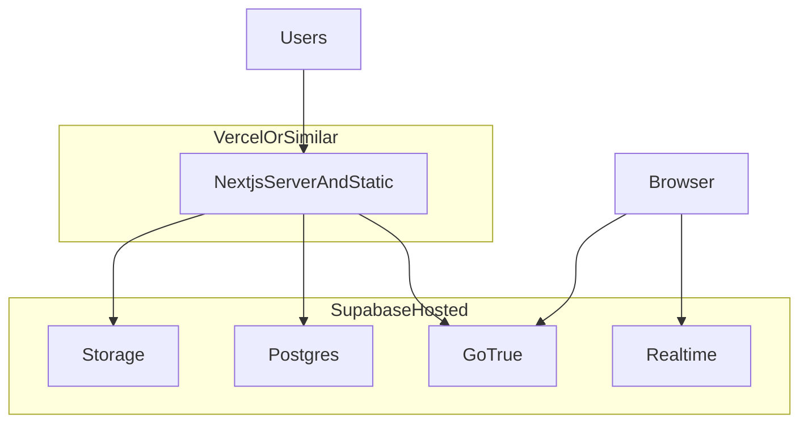

**Environment variables (conceptual):**

- `NEXT_PUBLIC_SUPABASE_URL`, `NEXT_PUBLIC_SUPABASE_ANON_KEY` — client + server anon access.
- `SUPABASE_SERVICE_ROLE_KEY` — **server only** (admin, bulk jobs, optional pregnancy read before RLS extension — prefer RLS policies over broad service use).
- `GEMINI_*`, `GROQ_*` — LLM + embeddings.

---

## 15. Evolution roadmap (architecture hooks)

- **Observability:** structured logging, tracing on `/api/chat` latency and RAG hit rate.
- **Evaluation:** golden dataset for Bangla/English safety and medical disclaimer compliance.
- **Agentic layer:** formalize tool-calling (calendar, triage checklist) behind the same session gate.
- **FHIR / export:** batch export for research pilots (new module, same auth).

---

## Document maintenance

When you add a major route or API:

1. Update **Section 4** (pages) and **Section 5** (API groups).
2. If you add a new external dependency, update **Section 1–2**.
3. If schema or **AI pipeline** changes, update **Section 6–7** and the in-app mirror `src/content/docs/architecture.md`.

---

*Generated from repository layout and key modules under `src/app`, `src/lib`, and `supabase/migrations`. For the hackathon pitch, cross-link with `docs/BUILDFEST-180S-PITCH.md`.*
