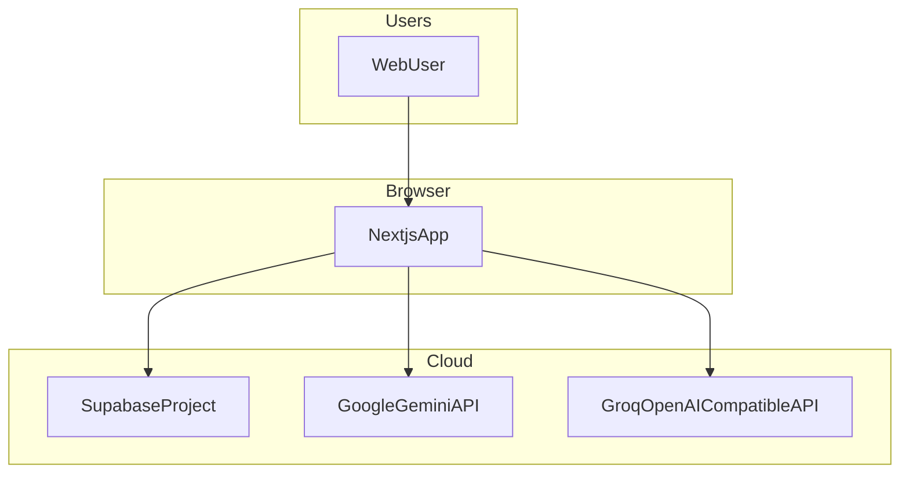
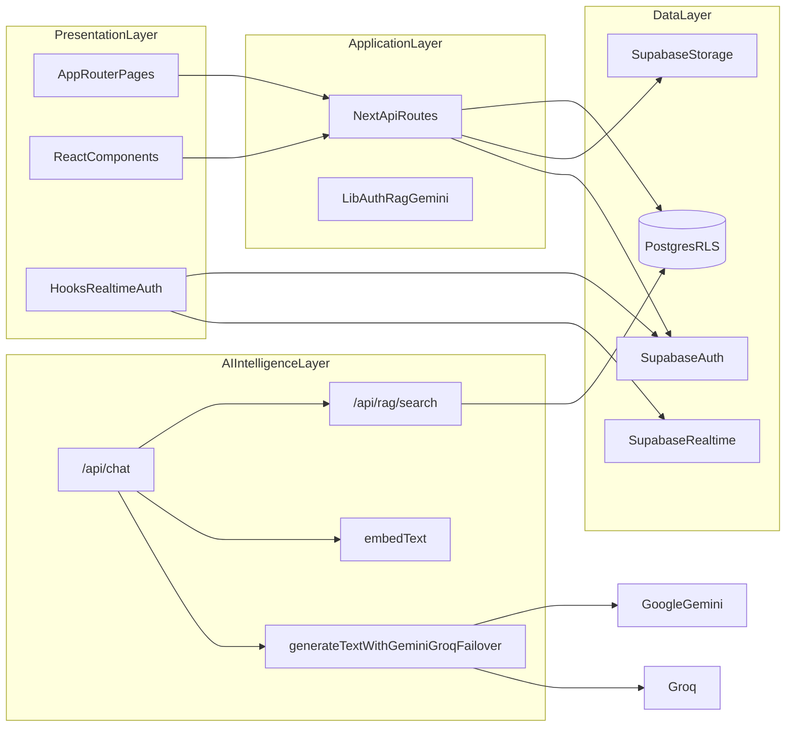
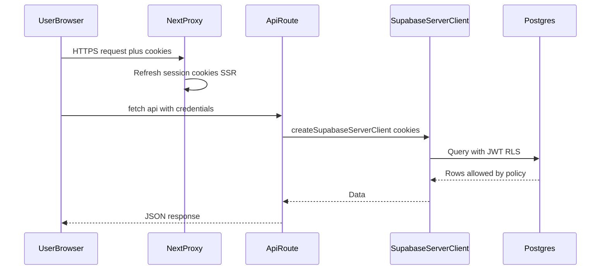
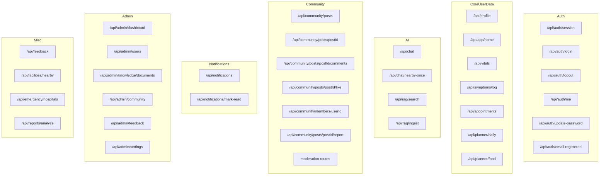
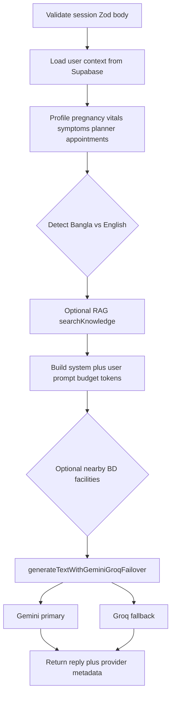
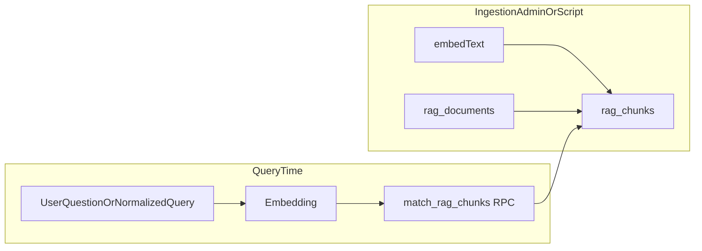
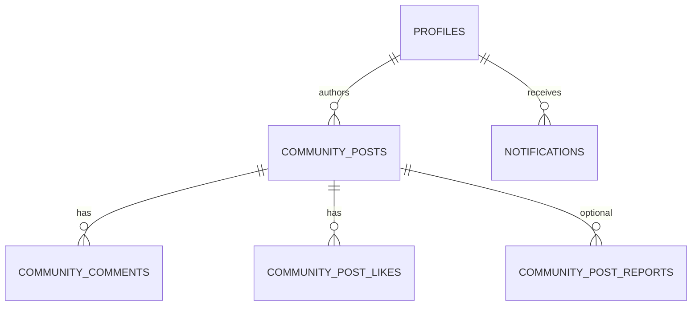
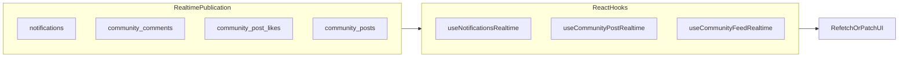
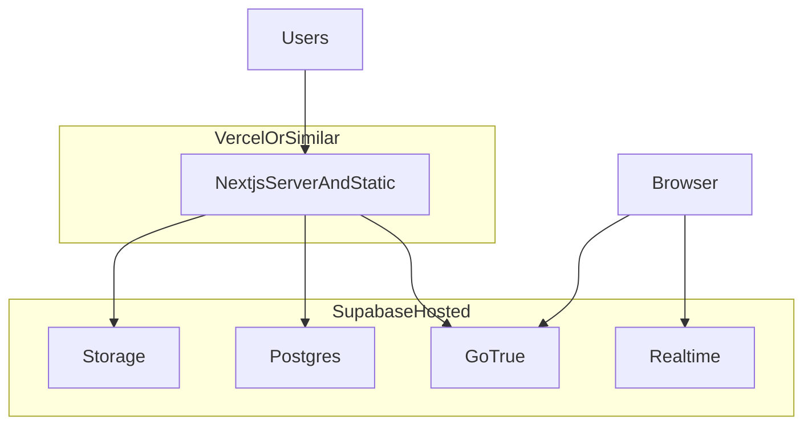

# MaaCare Platform — Advanced Architecture

This document describes the **as-built** architecture of the **maacare-platform** monorepo: Next.js (App Router), Supabase (Auth, Postgres, RLS, Storage, Realtime), multi-provider LLM chat with RAG, and supporting domains (community, vitals, symptoms, planner, admin).

---

## 1. System context (who talks to whom)

- **Browser** runs the React client (including `createSupabaseBrowserClient` for auth-aware operations and **Realtime** subscriptions).
- **Next.js** server handles Route Handlers under `src/app/api/**`, server components, and `proxy` (see `src/proxy.ts`) for cookie session refresh and route gating.
- **Supabase** is the system of record: Auth, Postgres, Row Level Security, Storage buckets, optional **Realtime** publication on selected tables.
- **Gemini** and **Groq** are called **server-side only** from API routes (keys never exposed to the client).

---

## 2. High-level containers

---

## 3. Request path and security boundary

- **`getSessionFromCookies`** (see `src/lib/auth/get-session.ts`) is the gate for protected APIs.
- **RLS** enforces tenant isolation on almost all user tables; admin routes use a **service-role gate** pattern where applicable.

---

## 4. Frontend map (App Router)

Major **user-facing** surfaces (non-exhaustive):

| Area | Routes / entry | Role |
|------|----------------|------|
| Marketing / entry | `/`, `/login`, `/signup`, `/forgot-password`, `/reset-password`, `/verify-otp`, `/auth/callback` | Acquisition, PKCE auth |
| App shell | `/app` | Logged-in home |
| AI assistant | `/chat` | LLM conversation UI |
| Profile | `/profile`, `/profile/edit`, `/settings`, `/help` | Identity, prefs, Bangla |
| Health | `/vitals`, `/symptoms`, `/symptoms/result`, `/appointments`, `/planner`, `/postpartum` | Structured data capture |
| Community | `/community`, `/community/create`, `/community/[postId]`, `/community/member/[userId]` | Social, threaded replies |
| Safety | `/emergency`, `/facilities`, `/guidance/[topic]` | Information / wayfinding |
| Reports | `/reports` | Document analysis flow (separate API stack) |
| Notifications | `/notifications` | In-app list |
| Admin | `/admin`, `/admin/users`, `/admin/knowledge`, `/admin/community`, `/admin/feedback`, `/admin/settings` | Operations, RAG corpus |

**Shared UI:** `AppShell`, `AppHeader`, `BottomNav`, `NotificationBell` (Sheet + Realtime-driven refresh patterns where enabled).

---

## 5. API surface (Route Handlers)

Grouped by concern:

---

## 6. AI chat pipeline (advanced)

Conceptual flow for **`POST /api/chat`** (`src/app/api/chat/route.ts`):

**Notable behaviors (product + engineering):**

- **Context assembly:** profile, pregnancy, health snapshot, latest vitals/symptoms, planner — bounded token budget (`MAX_TRANSCRIPT_*` constants).
- **Language:** `detectPreferredReplyLanguage` using Unicode Bangla range plus **Banglish** heuristic word list.
- **RAG:** `searchKnowledge` uses embeddings (`embedText` via Gemini) and `match_rag_chunks*` RPC against `rag_chunks` (vector in Postgres).
- **Resilience:** `generateTextWithGeminiGroqFailover` (`src/lib/gemini/text-failover.ts`) — try Gemini, then Groq on failure / empty response.
- **Geo:** optional `userLocation` + BD facilities intent to inject **nearby** context (`lib/bd-facilities`).
- **Voice mode:** `replyChannel` adjusts style (shorter, spoken).

---

## 7. Knowledge (RAG) subsystem

- **Tables:** `rag_documents`, `rag_chunks` (with `embedding` vector), managed in migrations under `supabase/migrations/`.
- **Service layer:** `src/lib/rag/service.ts` — `ingestKnowledgeChunk`, `searchKnowledge`.
- **Admin HTTP:** `src/app/api/admin/knowledge/documents/**` for CRUD / batch operations (gated).
- **User search API:** `src/app/api/rag/search/route.ts` (authenticated semantic search).

---

## 8. Community domain

- **Feed & CRUD:** `/api/community/posts` with search, sort, `forYou` hints.
- **Threaded comments:** `parent_comment_id` tree built client-side; post detail uses **`CommunityCommentThread`** component.
- **Likes:** `community_post_likes` + triggers for optional author notifications.
- **Moderation:** RPCs / routes for moderators hiding posts or comments.
- **Member profiles:** `/api/community/members/[userId]` — public-safe fields; pregnancy snippet when **`community_show_extended_profile`** + RLS policy allows read.
- **Realtime (optional):** `postgres_changes` subscriptions in `src/hooks/use-*-realtime.ts` after tables are added to **`supabase_realtime`** publication (migration `20260516120000_*`).

---

## 9. Notifications

- **Table:** `notifications` (kinds e.g. community reply / like / system / reminder).
- **Authoring:** SQL triggers on `community_comments` / `community_post_likes` insert into `notifications` for post authors (see migrations `20250515000000_*`, `20250517000000_*`).
- **API:** `GET /api/notifications`, `POST /api/notifications/mark-read` (per-id or `all: true`).
- **Client:** `NotificationBell` (full-height Sheet), `NOTIFICATIONS_UPDATED_EVENT` for cross-component refresh.

---

## 10. Data model (Postgres — conceptual clusters)

**Identity & profile**

- `profiles` (display, role, language, avatar, prefs, `community_show_extended_profile`, …)
- `auth.users` (Supabase managed)

**Health & journey**

- `pregnancy_profiles`, `user_health_profiles`, `vital_signs`, `symptom_logs`, `appointments`, `planner_daily_logs`, …

**Community**

- `community_posts`, `community_comments`, `community_post_likes`, `community_post_reports`, …

**AI knowledge**

- `rag_documents`, `rag_chunks` (+ vector index via pgvector extension in schema)

**Ops**

- `app_feedback`, admin feature flags, etc.

**Storage buckets (examples)**

- Avatars, community post images (see `supabase/migrations/*storage*.sql`).

---

## 11. Client ↔ Supabase Realtime

When enabled in DB and wired in UI:

RLS still applies: clients only receive changes for rows they could `SELECT` with the current JWT.

---

## 12. Admin plane

- **UI:** `src/app/admin/**` — dashboard, users, knowledge corpus, community moderation queue, feedback inbox, settings.
- **API:** `/api/admin/**` — uses **elevated** access pattern (service role or role checks via `lib/admin` patterns) — always server-side.
- **User moderation:** community reports, ban/confirm email flows under `api/admin/users/...`.

---

## 13. Cross-cutting concerns

| Concern | Implementation |
|---------|----------------|
| Validation | **Zod** on API bodies (`route.ts` files) |
| Errors | `failJson`, `serverErrorJson`, `validationJsonResponse` (`src/lib/api/error-response.ts`) |
| Theming | `next-themes` + `src/lib/theme.ts` |
| Voice | `src/lib/voice/*`, `VoiceCallPanel`, optional speech synthesis |
| i18n prefs | Profile `language` `en` \| `bn` + UI copy patterns |
| Mobile UX | Touch targets, `touch-manipulation`, safe-area insets, bottom nav |

---

## 14. Deployment topology (typical)

**Environment variables (conceptual):**

- `NEXT_PUBLIC_SUPABASE_URL`, `NEXT_PUBLIC_SUPABASE_ANON_KEY` — client + server anon access.
- `SUPABASE_SERVICE_ROLE_KEY` — **server only** (admin, bulk jobs, optional pregnancy read before RLS extension — prefer RLS policies over broad service use).
- `GEMINI_*`, `GROQ_*` — LLM + embeddings.

---

## 15. Evolution roadmap (architecture hooks)

- **Observability:** structured logging, tracing on `/api/chat` latency and RAG hit rate.
- **Evaluation:** golden dataset for Bangla/English safety and medical disclaimer compliance.
- **Agentic layer:** formalize tool-calling (calendar, triage checklist) behind the same session gate.
- **FHIR / export:** batch export for research pilots (new module, same auth).

---

## Document maintenance

When you add a major route or API:

1. Update **Section 4** (pages) and **Section 5** (API groups).
2. If you add a new external dependency, update **Section 1–2**.
3. If schema changes affect AI context, update **Section 6** and **Section 10**.

---

*Generated from repository layout and key modules under `src/app`, `src/lib`, and `supabase/migrations`. For the hackathon pitch, cross-link with `docs/BUILDFEST-180S-PITCH.md`.*
