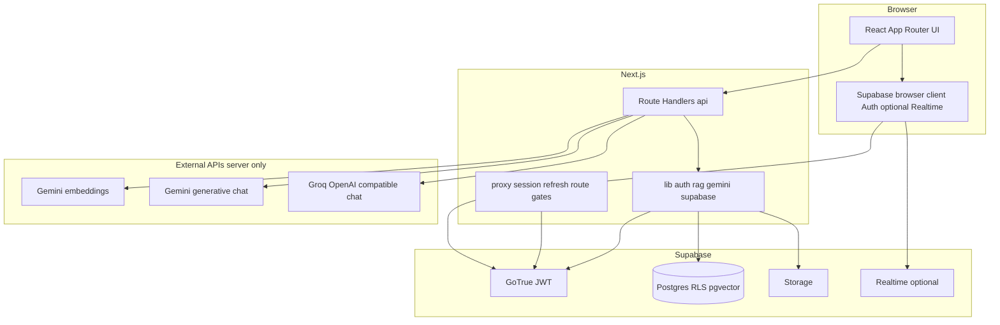
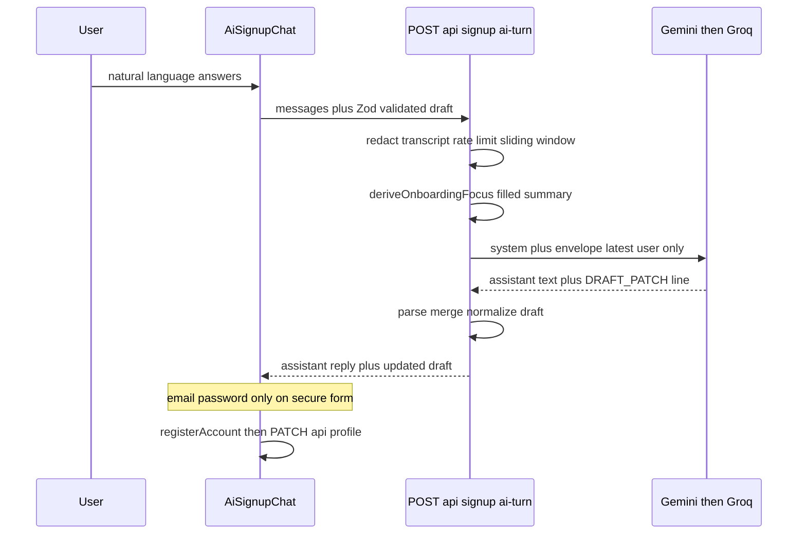
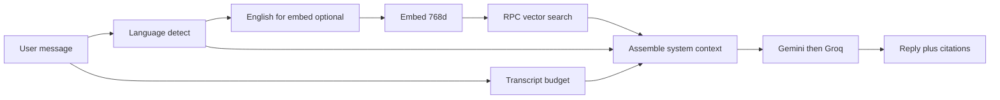
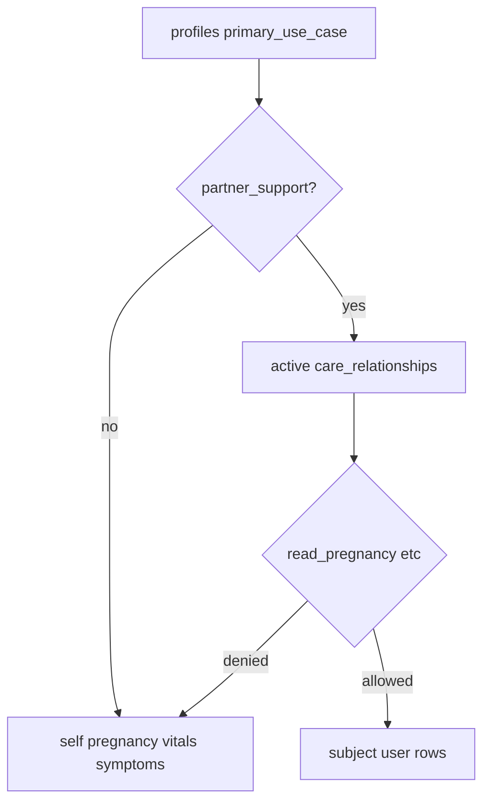
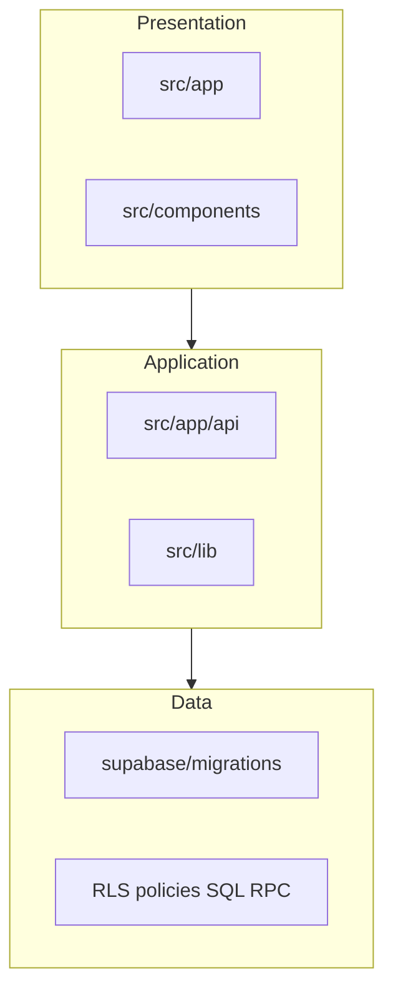

# MaaCare Platform — Judge & Panel Technical Brief

**Purpose:** A single, evidence-based technical narrative for hackathon judges, grant reviewers, and senior engineers evaluating depth of architecture, AI design, privacy, and product craft.

**Companion references (maintain in sync with code):**

- [`docs/ARCHITECTURE.md`](./ARCHITECTURE.md) — long-form diagrams (chat sequence, deployment, RAG ingest vs query).
- [`src/content/docs/algorithms.md`](../src/content/docs/algorithms.md) — in-app docs mirror (language, RAG, failover).
- [`docs/persona-care-privacy.md`](./persona-care-privacy.md) — persona matrix and care-link RLS rules.
- [`docs/PRESENTATION-SCRIPT-10MIN-COMPREHENSIVE.md`](./PRESENTATION-SCRIPT-10MIN-COMPREHENSIVE.md) — **10-minute** spoken script, slide outline, technical encyclopedia, Q&A bank.

---

## 1. Executive summary

MaaCare is a **Next.js App Router** application backed by **Supabase** (Auth, Postgres with **RLS**, Storage, optional Realtime). **All LLM and embedding API keys live only on the server** (Route Handlers under `src/app/api/**`). The product combines:

- **Conversational and form-based onboarding** with a shared, Zod-validated profile draft model.
- **Retrieval-augmented generation (RAG)** over a **pgvector** corpus (`rag_chunks`) via RPC `match_rag_chunks_for_user`, with **768-D Gemini embeddings**.
- **Multilingual UX** (English / Bangla) with **script detection**, **Banglish heuristics**, and **English-normalized retrieval** so embeddings stay semantically stable without forcing the user’s reply language.
- **Operational resilience:** **Gemini → Groq** chat failover, **multi-key rotation** on rate limits, and conservative clinical copy rules in triage-style flows.
- **Privacy-aware “shared pregnancy”** for partners via **`care_relationships`**, explicit JSON permissions, and **resolver logic** that chooses whose `pregnancy_profiles` / vitals / symptoms row backs Home and chat context.
- **Full vertical product surface (eight pillars):** personalized **RAG chat**, **Home**, **symptom analyzer**, **report simplifier**, **emergency + hospital/pharmacy finder**, **community + DMs**, **admin panel**, **postpartum** — each mapped to code in **§1b** below.

---

## 1b. Complete product feature matrix (eight pillars)

Use this as a **demo checklist** and **judge Q&A index**. Each row ties **user-visible value** to **engineering / AI**.

### 1) AI-powered personalized health chat

| Layer | Detail |
|--------|--------|
| **UX** | `/chat` — threaded assistant turns; optional **voice** channel (spoken-style prompts, tuned temperature). |
| **Pipeline** | `POST /api/chat`: **Zod** validation → **Bangla / Banglish** language routing → **English-normalized retrieval query** (optional) → **Gemini embedding (768-D)** → **`match_rag_chunks_for_user`** → parallel **profile, pregnancy, planner, appointments** (and **Bangladesh facility** rows when intent + location match) → **`generateTextWithGeminiGroqFailover`** → JSON with **reply**, **provider**, **citations**, optional **`needsClientLocation`**. |
| **Innovation** | Retrieval **before** generation; answers grounded in **your** journey context, not a generic system prompt. |

### 2) Home (command center)

| Layer | Detail |
|--------|--------|
| **UX** | `/app` — journey-aware hero (gestational / postpartum), vitals snapshot, latest symptom, upcoming appointment, unread notifications; **persona-gated** surfaces via `HomeData.ui`. |
| **Backend** | `getHomeData` (`src/lib/app/home-data.ts`) resolves **which user’s rows** to read (`care_relationships` + `primary_use_case`); **parallel** Supabase reads; exposes **`HomeData`** + **`UserAppContext`**. |
| **UX polish** | Refetch on **window focus** (`home-client.tsx`) so returning users see fresh counts. |

### 3) Symptom analyzer

| Layer | Detail |
|--------|--------|
| **UX** | Symptom logging flows + per-log **insights** (severity, titles, optional free text). |
| **AI** | `GET` (and related) on `src/app/api/symptoms/log/[id]/route.ts`: **`searchKnowledge`** for risk rules → **conservative** LLM copy (no diagnosis; escalation language) + **JSON-array** practical next-step suggestions **grounded only** on retrieved context. |

### 4) Report simplifier

| Layer | Detail |
|--------|--------|
| **UX** | `/reports` — upload / analyze medical documents in product flow. |
| **AI** | `POST /api/reports/analyze` (see `docs/ARCHITECTURE.md` §5) — server-side LLM analysis with **Groq-capable** text path where wired; separate from main chat RAG stack but same **keys-on-server** rule. |

### 5) Emergency + hospital + pharmacy finder

| Layer | Detail |
|--------|--------|
| **UX** | `/emergency` — hotlines / urgent guidance surfaces; `/facilities` — map/list with **`emergency` vs `pharmacy`** presets over **Bangladesh OSM-derived** points (hospitals, clinics, pharmacies). |
| **Data / APIs** | `src/app/api/emergency/hospitals`, `src/app/api/facilities/nearby` (and related); **chat** can inject **nearby facility catalog** into context when user intent + coordinates align (`src/lib/bd-facilities/*`). |
| **Smart thinking** | **Deterministic geo** for facilities where possible; **LLM** for nuanced “what should I do now?” — split responsibilities. |

### 6) Community + user-to-user messaging

| Layer | Detail |
|--------|--------|
| **Community UX** | `/community` feed, `/community/create`, `/community/[postId]` — **threaded** comments, likes, moderation hooks, member profiles `/community/member/[userId]`. |
| **Realtime** | Optional **Supabase Realtime** on community tables; **debounced** refetch after bursts (`algorithms.md`). |
| **Direct messages** | **`/messages`**, **`/messages/[conversationId]`**, start-from-member **`/messages/start?peer=`** — **`dm_conversations` / `dm_messages`** with **RLS**, RPC **`dm_start_or_get_conversation`**, APIs under `src/app/api/dm/**`, **Realtime** subscription on thread (`dm-thread-client.tsx`). |

### 7) Advanced admin panel

| Layer | Detail |
|--------|--------|
| **UX** | `/admin` and nested routes — users, knowledge/RAG corpus, community moderation, feedback, settings, **developer team** directory, etc. |
| **Security** | **`requireDbAdmin`** + service-role patterns; mutations that affect **public landing** call **`revalidateLandingTeamCache()`** (tagged Next cache). |

### 8) Postpartum

| Layer | Detail |
|--------|--------|
| **UX** | Dedicated **postpartum** journey surfaces (e.g. `/postpartum`) and mood/week-aware UI where implemented. |
| **AI** | `getPostpartumInsightsCached` — **RAG** (`searchKnowledge`) + structured **JSON** generation; **in-memory TTL cache** + bounded map eviction for cost/latency control (`src/lib/postpartum/ai-insights.ts`). |

---

## 2. System context (one view)

---

## 3. Innovation & engineering catalog

| Area | What judges should notice | Primary code / docs |
|------|---------------------------|----------------------|
| **AI-assisted registration** | Guided chat fills a structured draft; model emits `DRAFT_PATCH` JSON; credentials never enter the model thread; IP rate limits; transcript redaction; sliding window. | `src/app/api/signup/ai-turn/route.ts`, `src/components/signup/ai-signup-chat.tsx`, `src/lib/signup/*` |
| **Manual vs AI signup** | Same `SignupProfileDraft` + normalization; user toggles mode (`?mode=ai`). | `src/app/signup/signup-page-client.tsx`, `src/lib/signup/signup-draft.ts` |
| **Onboarding state machine** | Server derives `nextFocus` + `modelInstruction` from draft so the LLM is steered phase-by-phase (name → role → optional fields). | `src/lib/signup/onboarding-focus.ts` |
| **Main assistant (RAG)** | Session + Zod validation; parallel DB context (profile, pregnancy, planner, etc.); vector search; citations payload to client. | `src/app/api/chat/route.ts`, `src/lib/rag/service.ts` |
| **RAG retrieval** | `embedText` → RPC `match_rag_chunks_for_user` with category filters and similarity floor. | `src/lib/gemini/embeddings.ts`, `src/lib/rag/service.ts` |
| **LLM failover** | Ordered Gemini keys; on failure/empty → Groq; rate-limit aware. | `src/lib/gemini/text-failover.ts`, `src/lib/gemini/keys.ts` |
| **Symptom insights** | RAG-grounded conservative triage copy + structured JSON suggestions from model-only-on-context. | `src/app/api/symptoms/log/[id]/route.ts` |
| **Postpartum insights** | RAG + JSON generation with in-memory TTL cache and bounded map eviction. | `src/lib/postpartum/ai-insights.ts` |
| **Planner nutrition** | Week-aware meal suggestions with RAG context. | `src/app/api/planner/food/route.ts` |
| **Personas & shared care** | `primary_use_case` drives UI; partners resolve pregnancy/vitals/symptoms user IDs via active care + permissions. | `src/lib/app/care-access.ts`, `src/lib/app/user-app-context.ts`, `src/lib/app/home-data.ts`, `docs/persona-care-privacy.md` |
| **Home aggregation** | One server shape (`HomeData`) with `ui` visibility flags for gated surfaces. | `src/lib/app/home-types.ts`, `src/app/app/home-client.tsx` |
| **Public team directory** | `unstable_cache` + `revalidateTag` on admin/developer mutations; HTTP cache headers when service role present. | `src/lib/team/landing-team-members.ts`, `src/app/api/team/route.ts` |
| **Emergency & facilities** | OSM-backed BD catalog + dedicated emergency UX; optional injection into chat context. | `src/app/emergency/*`, `src/app/facilities/*`, `src/app/api/emergency/*`, `src/app/api/facilities/*` |
| **Report simplifier** | Document analyze route; server LLM; keys never in browser. | `src/app/reports/*`, `src/app/api/reports/analyze` |
| **Community + DMs** | Posts/comments/likes + **1:1** `dm_*` tables, RPC, Realtime thread subscriptions. | `src/app/community/*`, `src/app/messages/*`, `src/app/api/dm/*`, `supabase/migrations/*dm*` |
| **Admin operations** | Gated admin APIs + UI for corpus, users, moderation, team directory. | `src/app/admin/*`, `src/app/api/admin/*` |
| **Security boundary** | Cookie session; RLS; service role only server-side; proxy gating. | `src/proxy.ts`, `src/lib/auth/get-session.ts`, `docs/ARCHITECTURE.md` §3 |

---

## 4. AI-assisted registration (deep dive)

This is one of the strongest “product + ML safety” stories: **registration through chat** without ever sending passwords through the model.

**Engineering controls:**

- **Structured extraction:** `DRAFT_PATCH:{...}` minified JSON line; merged via `mergeSignupProfileDraft` (`src/lib/signup/ai-draft-patch.ts`).
- **Prompt contract:** System prompt forbids email/password/OTP in chat and in patch (`src/app/api/signup/ai-turn/route.ts`).
- **Transcript hygiene:** `redactTranscriptForLlm` (`src/lib/signup/redact-for-llm.ts`).
- **Context window discipline:** tail of last **8** turns; digest line when older messages dropped; max messages/chars per request.
- **Abuse resistance:** per-IP per-minute counter in route handler (`MAX_PER_IP_PER_MIN`, env-tunable).
- **Echo control:** `trimEchoOfPreviousAssistant` reduces repetitive assistant parroting.

---

## 5. Main chat pipeline (RAG + personalization)

High-level flow (detail in `docs/ARCHITECTURE.md` §6):

1. **Authenticate** and validate body with **Zod**.
2. **Language routing:** Unicode Bangla vs **Banglish** Latin token hints → preferred reply language (`src/content/docs/algorithms.md`).
3. **Retrieval query:** optional **English normalization** for embedding semantics (same failover helper as chat).
4. **Embed** query (`embedText` → Gemini embedding model, 768-D).
5. **Vector search:** `match_rag_chunks_for_user` with limits and category filters.
6. **Context assembly:** retrieved passages + **parallel profile / pregnancy / planner / appointments** (and optional **Bangladesh facilities** when intent + location match).
7. **Generate:** `generateTextWithGeminiGroqFailover` — voice channel uses slightly higher temperature and spoken-style rules (`replyChannel: "voice"`).
8. **Response:** reply text, **provider id**, optional `needsClientLocation`, **citations** array (id, score, title, source, excerpt).

---

## 6. Personas, care relationships, and data routing

**Problem:** A partner should see the pregnant partner’s timeline **only** with explicit consent and granular read flags—not a second “fake” pregnancy on their own profile.

**Solution:**

- `profiles.primary_use_case` (e.g. `partner_support`) plus **`care_relationships`** (`status`, `permissions` JSON).
- **Resolvers:** `resolvePregnancyUserIdForRequester`, `resolveHealthDataUserId` (`src/lib/app/care-access.ts`) choose **subject vs self** for pregnancy row, vitals, and symptoms.
- **UI gating:** `buildUserAppContext` + `deriveHomeUiVisibility` (`src/lib/app/user-app-context.ts`) feed **`HomeData.ui`** so the client renders gated heroes and CTAs consistently (`src/lib/app/home-data.ts`, `src/app/app/home-client.tsx`).

See the **matrix table** in [`docs/persona-care-privacy.md`](./persona-care-privacy.md).

---

## 7. Resilience, cost, and micro-optimizations

| Technique | Where / why |
|-----------|--------------|
| **Multi-key Gemini rotation** | `generateTextWithGeminiGroqFailover` tries keys sequentially; treats quota-like errors as “try next”. |
| **Groq fallback** | Same system/user envelope when Gemini chat fails or returns empty. |
| **Transcript budgeting** | Chat: char/4 heuristic to cap prompt size (`algorithms.md`). Signup: fixed tail window. |
| **In-process insight cache** | Postpartum: TTL map + sweep when size > 400 (`src/lib/postpartum/ai-insights.ts`). |
| **Tagged server cache** | Landing team: `unstable_cache` + `revalidateTag(..., { expire: 0 })` on mutations (`src/lib/team/landing-team-members.ts`). |
| **Dual path for team API** | If `SUPABASE_SERVICE_ROLE_KEY` missing (local dev), skip global cache of cookie-scoped reads; use live query + `no-store` (`src/app/api/team/route.ts`). |
| **Home refresh on focus** | `window` focus triggers `/api/app/home` refetch for freshness (`src/app/app/home-client.tsx`). |
| **Parallel planner loads** | `Promise.all` for home, appointments, symptoms then conditional food plan (`src/app/planner/page.tsx`). |
| **Community realtime debounce** | Debounced refetch after burst events (documented in `algorithms.md`). |

---

## 8. User experience (selected craft)

- **Dual onboarding paths** (wizard vs chat) with clear security copy: chat explains email/password are **only** on the secure step (`AiSignupChat` seed message).
- **Reduced-motion awareness** | e.g. team carousel and motion on landing (`useReducedMotion` in `src/app/page.tsx`).
- **Accessibility-oriented controls** | Team section uses `role="radiogroup"` patterns for sex selection cards (`src/components/profile/sex-icon-cards.tsx`); landing team section uses skeletons instead of bare “Loading…”.
- **Voice mode** | Distinct prompt and temperature path for spoken output (`/api/chat`).
- **Citations** | Chat returns structured citation metadata for transparency in medically grounded answers.

---

## 9. Security & compliance posture (technical)

- **No LLM keys in the browser** — all generation and embedding on the server.
- **RLS** on user tables; admin routes gated (`requireDbAdmin`, service role where appropriate).
- **Proxy** (`src/proxy.ts`) refreshes sessions and enforces route policy before sensitive pages.
- **Conservative clinical language** in symptom and triage-style prompts (e.g. “do not diagnose”, red-flag escalation language in `src/app/api/symptoms/log/[id]/route.ts`).
- **Care link abuse model** | Pending vs active; accept/revoke semantics documented in `persona-care-privacy.md`.

---

## 10. Data & AI governance (RAG)

- **Chunked knowledge** in Postgres with vector similarity; **category filters** for domain-specific routes (postpartum, planner, etc.).
- **Admin ingestion path** for corpus operations (see API map in `docs/ARCHITECTURE.md` §5).
- **User-visible citations** from chat route help judges see **grounding**, not just generative fluency.

---

## 11. Suggested talking points (60-second pitch)

1. **Eight shipped surfaces** — personalized **RAG chat**, **Home** resolver, **symptom analyzer** with grounded insights, **report simplifier**, **emergency + facility finder** (hospitals/clinics/pharmacies), **community + threaded replies + DMs**, **admin** operations, **postpartum** AI insights with caching.
2. **“AI signup with a safety contract”** — structured `DRAFT_PATCH`, Zod-validated draft, no credentials in-model, rate limits, redaction.
3. **“RAG-first assistant”** — embeddings + pgvector RPC + citations, not generic chat.
4. **“Real-world relationships in the data model”** — partner support with explicit JSON permissions and resolver-driven Home/chat context.
5. **“Production-style reliability”** — Gemini/Groq failover, multi-key handling, tagged revalidation for public caches.
6. **“Geo + language realism”** — Bangladesh facility data in-product; Bangla/Banglish routing without dumbing down retrieval.

---

## 12. Diagram — repository layers (maintenance view)

---

## 13. Appendix — key entry files (quick index)

| Concern | Path |
|---------|------|
| Chat + RAG | `src/app/api/chat/route.ts` |
| Signup AI turn | `src/app/api/signup/ai-turn/route.ts` |
| Embeddings + search | `src/lib/gemini/embeddings.ts`, `src/lib/rag/service.ts` |
| Text failover | `src/lib/gemini/text-failover.ts` |
| Home bundle | `src/lib/app/home-data.ts`, `src/app/api/app/home/route.ts` |
| Care resolution | `src/lib/app/care-access.ts` |
| Persona UI flags | `src/lib/app/user-app-context.ts` |
| Symptom insights | `src/app/api/symptoms/log/[id]/route.ts` |
| Postpartum AI | `src/lib/postpartum/ai-insights.ts` |
| Reports analyze | `src/app/api/reports/analyze` (see `docs/ARCHITECTURE.md`) |
| Emergency / facilities | `src/app/emergency/*`, `src/app/facilities/*`, `src/app/api/emergency/*`, `src/app/api/facilities/*` |
| Community | `src/app/community/*`, `src/app/api/community/*` |
| Direct messages | `src/app/messages/*`, `src/app/api/dm/*` |
| Admin | `src/app/admin/*`, `src/app/api/admin/*` |
| Landing team cache | `src/lib/team/landing-team-members.ts` |
| Long architecture write-up | `docs/ARCHITECTURE.md` |

---

*This brief is descriptive of the repository as built; when behavior changes, update the linked docs and this file in the same PR.*
