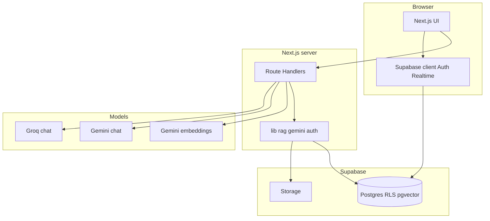

# MaaCare — 10-Minute Comprehensive Presentation Script

**Audience:** judges, investors, senior engineers, clinical partners.  
**Goal:** Prove the product is **real**, the **AI design is intentional**, and the **architecture scales**.  
**How to use this file**

| Section | Use |
|---------|-----|
| **Part A — Teleprompter (~10:00)** | Read aloud at **~125–135 words/min** (~**1,250–1,350** words total). Rehearse with a stopwatch; trim sentences marked **[OPTIONAL]**. |
| **Part B — Slide bullets** | One slide per subsection; paste bullets verbatim or shorten. |
| **Part C — Technical encyclopedia** | Handout / appendix / backup slides—not meant to be spoken in 10 minutes. |
| **Part D — Q&A bank** | Post-talk questions. |

**Cross-references:** [`docs/JUDGE-PANEL-TECHNICAL-BRIEF.md`](./JUDGE-PANEL-TECHNICAL-BRIEF.md) (feature matrix §1b), [`docs/ARCHITECTURE.md`](./ARCHITECTURE.md) (diagrams §6), [`src/content/docs/algorithms.md`](../src/content/docs/algorithms.md), [`docs/persona-care-privacy.md`](./persona-care-privacy.md).

---

# Part A — Teleprompter (target ~10 minutes spoken)

### A1 · 0:00–1:00 — Problem, users, urgency

Good morning. I’m presenting **MaaCare**—an **AI-native** companion for **pregnancy through postpartum**—as a **shipped web application**, not a concept deck.

**The problem** is **continuity of care**. In Bangladesh and globally, families often get strong minutes inside a clinic, then **weeks between visits** with unanswered questions. Trusted information is frequently **English-first**; social feeds mix anecdotes and misinformation. **Generic LLMs** hallucinate, omit gestational week and medications, and erode trust when stakes are high.

**Who we serve:** expecting parents, **postpartum** households, **partners** supporting a pregnancy, and clinicians using the product for their own journey—**Bangla and English** as real product paths, not a bolt-on translation.

**Our thesis:** maternal support needs **retrieval-grounded answers**, **longitudinal structured context**, and **database-enforced privacy**—together, not traded off.

---

### A2 · 1:00–2:00 — Stack, security boundary, architecture bones

**Stack:** **Next.js App Router** for UI and **Route Handlers** under `src/app/api`, backed by **Supabase**—Auth, **Postgres with RLS**, **Storage**, optional **Realtime**.

**Security boundary:** **LLM and embedding keys exist only on the server.** The browser never holds Gemini or Groq secrets. **`getSessionFromCookies`** gates protected APIs; **`createSupabaseServerClient`** forwards the user JWT so **RLS** decides every row. A **`proxy`** refreshes auth cookies and enforces route policy before sensitive surfaces.

**Architecture shape:** **presentation** (React pages), **application** (API routes + `src/lib`), **data** (SQL policies, RPCs like **`match_rag_chunks_for_user`**, triggers for notifications), and an **intelligence layer** (embed → retrieve → assemble prompt → **Gemini then Groq failover**). That separation is what lets us ship **chat, home, clinical logs, social, admin, and marketing** in one monorepo without spaghetti.

---

### A3 · 2:00–3:00 — Eight product pillars (inventory)

MaaCare is not “one chatbot.” It is **eight integrated pillars**, each with its own routes and engineering story.

**One:** **Personalized health chat** at `/chat`—RAG, citations, voice mode, optional Bangladesh **facility injection** when the user shares location and intent matches.

**Two:** **Home** at `/app`—aggregated pregnancy week, vitals, latest symptom, appointments, unread notifications—driven by **`getHomeData`** and persona **`HomeData.ui`** flags.

**Three:** **Symptom analyzer**—structured logs plus **RAG-grounded** insight text and **JSON** next-step suggestions that refuse to invent beyond retrieved risk rules.

**Four:** **Report simplifier** at `/reports` with **`/api/reports/analyze`**—server-side document intelligence, same “keys on server” rule.

**Five:** **Emergency and wayfinding**—`/emergency` plus **`/facilities`** with **hospital, clinic, and pharmacy** presets over **OSM-derived Bangladesh** points.

**Six:** **Community and user-to-user messaging**—threaded posts at `/community`, private **DMs** at `/messages` on **`dm_conversations` / `dm_messages`** with **RLS** and **Realtime** subscriptions.

**Seven:** **Advanced admin** at `/admin`—users, **knowledge corpus** for RAG, moderation, feedback, settings, developer team directory.

**Eight:** **Postpartum** journey surfaces with **`getPostpartumInsightsCached`**—RAG plus structured JSON and a **TTL in-memory cache** with bounded eviction for cost control.

---

### A4 · 3:00–4:00 — Main AI pipeline: chat, RAG, multilingual, voice

The flagship path is **`POST /api/chat`**. **Zod** validates the body. We take the **latest user message** and run **language routing**: Unicode **Bangla script** detection plus a **Banglish** Latin-token heuristic with a multi-hit threshold to reduce false positives.

For retrieval, if the user’s preferred reply is Bangla, we optionally call **`normalizeQueryForEnglishRetrieval`**—a **small LLM translation** step—so **embeddings** see English-like semantics while the **final answer stays in Bangla**. We then **`embedText`** with Gemini’s **768-dimensional** model and call **`match_rag_chunks_for_user`** with **similarity floors** and optional **category filters**.

In parallel we read **profile, pregnancy, conditions, allergies, medications, vitals, symptoms, planner logs, appointments**—that string becomes **personal health context** in the system prompt. We **budget the transcript** with a character-to-token heuristic so prompts stay bounded. If nearby-care intent matches and coordinates exist, we inject **Bangladesh facility rows**; if intent matches but coordinates are missing, we return **`needsClientLocation`** so the client can prompt consent.

Finally **`generateTextWithGeminiGroqFailover`**: ordered **Gemini API keys**, quota-aware rotation, then **Groq** OpenAI-compatible chat on failure or empty output. **`replyChannel: "voice"`** adds spoken-output rules and a **higher temperature**. The response includes **`citations`**—chunk id, score, title, source, excerpt—so “grounded” is not a slogan, it is structured data.

---

### A5 · 4:00–5:00 — Home, personas, partner care, profile

**Home** is assembled in **`getHomeData`**: we read **`profiles.primary_use_case`** and **`care_relationships`**. For **`partner_support`**, **`resolvePregnancyUserIdForRequester`** may switch the pregnancy row to the **subject** partner when the link is **active** and **`read_pregnancy`** is allowed; **`resolveHealthDataUserId`** does the same pattern for **vitals** and **symptoms** with **`read_vitals`** and **`read_symptoms`**. That is how we avoid a **second fake pregnancy** on the supporter’s account while still showing an honest shared timeline when consent exists.

**`buildUserAppContext`** plus **`deriveHomeUiVisibility`** produce **`HomeData.ui`** so the client **gates** surfaces consistently—heroes, CTAs, and density—without duplicating business rules in React.

**`HomeClient`** refetches **`/api/app/home`** on **window focus** so counts and cards refresh when users return from another tab.

**Profile** is the contract for personalization: **`PATCH /api/profile`** carries journey fields, language, notifications, and persona fields—fed back into chat and home on the next server read.

---

### A6 · 5:00–6:00 — Symptom AI, reports, postpartum, planner

**Symptoms:** logging APIs persist structured events; **`GET`** on **`/api/symptoms/log/[id]`** runs **`searchKnowledge`**, builds a **RISK-RULES** context block, and asks the model for **plain-language insight** plus a **strict JSON array** of practical next steps—**no diagnosis** language; escalation when rules imply urgent care.

**Reports:** **`/api/reports/analyze`** (and related extract routes) keep document processing **server-side**—aligned with the same failover text stack where wired.

**Postpartum:** **`getPostpartumInsightsCached`** composes a retrieval query from week and mood themes, calls RAG, then asks for **JSON body** insights; results are cached in a **Map** with **TTL** and periodic eviction when the map grows past hundreds of entries—**latency and cost discipline**.

**Planner:** **`/api/planner/food`** uses **gestational week** and RAG to propose meals; the planner page batches **`Promise.all`** loads for home, appointments, and symptoms before food—**parallel IO** to reduce perceived load time.

---

### A7 · 6:00–7:00 — Emergency, facilities, community, DMs, notifications

**Emergency** pages surface hotlines and urgent guidance UX. **Facilities** combine **client geolocation or map** interaction with APIs like **`/api/facilities/nearby`** over imported **OpenStreetMap** points—**pharmacy** and **emergency** presets are first-class. This is **deterministic geo** where possible; the **LLM** handles nuanced “what should I do” questions in chat when retrieval and personal context apply—**separation of concerns**, not one hammer.

**Community:** feed, create post, post detail with **threaded comments** and likes; **Realtime** optionally pushes **`postgres_changes`**; the client **debounces** bursts before refetching lists so UI stays stable.

**Direct messages:** **`dm_start_or_get_conversation`** RPC normalizes user pair ordering; **`dm_participants`** tracks read state; **`dm_messages`** powers **`/messages/[id]`** threads with **RLS** so only participants read; **Realtime** on the thread client keeps inbox feeling live.

**Notifications:** DB **triggers** can enqueue **`notifications`** rows on engagement; the bell merges **REST** with optional **Realtime**—documented in our algorithms note.

---

### A8 · 7:00–8:00 — Onboarding innovation: wizard + AI chat signup

We ship **two onboarding paths** sharing **`SignupProfileDraft`** and **Zod** schemas: a **manual wizard** and **`/signup?mode=ai`** chat.

**`POST /api/signup/ai-turn`** sends the model a **filled summary** and a **`deriveOnboardingFocus`** instruction—**state-machine steering**: ask display name first, then profession, then optional health fields—so the LLM does not wander. The model must end with **`DRAFT_PATCH:{...}`** minified JSON; we **merge**, **normalize** from free text, and echo-trim assistant repetition. **Transcript redaction**, **max messages**, **max chars**, and **per-IP per-minute** counters reduce abuse. **Passwords never** enter the transcript—credentials post only to the **secure form**, then **`registerAccount`** plus **`PATCH /api/profile`**.

That is **creative AI product design**: structured extraction **without** treating the LLM as a database.

---

### A9 · 8:00–9:00 — Admin, developer tools, marketing engineering

**Admin** routes use **`requireDbAdmin`** and service-role patterns for corpus ingestion, user support, community moderation, feedback triage, and configuration.

**Developer team directory:** developers edit **`/developer`**; admins publish ordering on **`/admin/developer-team`**. Public landing reads **`/api/team`** backed by **`unstable_cache`** when service role exists, with **`revalidateTag(..., { expire: 0 })`** on mutations—**cache correctness**, not stale marketing rosters.

**Creative UX:** landing **team** section uses **skeleton loading**, **premium backdrop SVG**, and **Swiper** with **reduced-motion** respect; profile sex selection uses **accessible icon cards** instead of opaque dropdowns—**craft** matters for trust in health.

---

### A10 · 9:00–10:00 — Resilience, impact, roadmap, close

**Resilience recap:** multi-key Gemini, Groq failover, RAG RPC, transcript budgets, TTL caches where appropriate, RLS everywhere, server-only secrets.

**Impact metrics we are built to measure:** weekly and monthly actives, sessions per user, **Bangla versus English** usage, **RAG hit rate** and **citation coverage**, community and **DM engagement**, **symptom escalation** patterns, and report analyze volume.

**Roadmap:** expand **clinician-reviewed** corpus with versioning; **Bangladesh pilot** with clinic or NGO; **offline-tolerant** UX on slow networks; **evaluation harness**—golden prompts, automated regression, human review on safety-critical paths.

MaaCare is **idea plus engineering**: **eight user-facing pillars**, **one coherent architecture**, **retrieval-first AI**, and **privacy-aware relationships** in the database. Thank you—we are happy to take questions.

---

# Part B — Suggested slides (10 slides = one per minute)

| # | Slide title | Bullets (max 5) |
|---|-------------|-----------------|
| 1 | MaaCare — continuity of care | BD + global; clinic strong / between-visit weak; trust gap |
| 2 | Stack & trust boundary | Next.js; Supabase RLS; keys server-only; proxy + Zod |
| 3 | Eight pillars | Chat; Home; Symptoms; Reports; Emergency+facilities; Community+DMs; Admin; Postpartum |
| 4 | Chat pipeline | Lang → embed 768D → RPC; parallel health reads; Gemini→Groq; citations |
| 5 | Home + personas + care links | getHomeData; resolve pregnancy/vitals/symptoms; HomeData.ui |
| 6 | RAG surfaces | Symptoms JSON; postpartum cache; planner food |
| 7 | Safety + social + geo | Emergency; OSM facilities; community Realtime debounce; dm_* RLS |
| 8 | AI signup | DRAFT_PATCH; onboarding focus; redact + rate limit; secure creds |
| 9 | Ops + craft | Admin; team cache revalidate; a11y + motion-safe UX |
| 10 | Impact + roadmap | KPIs; pilot; corpus + eval harness |

---

# Part C — Technical encyclopedia (reference; not spoken verbatim)

## C1 — Algorithms & heuristics (non-exhaustive)

| Algorithm / heuristic | Behavior | Where |
|----------------------|----------|--------|
| **Bangla script detect** | Unicode range on latest user message | `src/app/api/chat/route.ts` |
| **Banglish detect** | Latin tokens vs curated hints; multi-hit threshold | same |
| **Preferred reply language** | `bn` vs `en` drives system instructions | same |
| **Transcript budget** | char length ÷ 4 token estimate; older turns dropped | `algorithms.md`, chat route |
| **Retrieval query normalize** | Optional LLM translate for embedding only | chat route |
| **Vector retrieval** | Cosine similarity via `match_rag_chunks_for_user` | `src/lib/rag/service.ts` |
| **Chunk ingest** | Splitting, embedding, insert `rag_chunks` | `src/lib/rag/service.ts`, admin flows |
| **Rate limit signup AI** | Per-IP per-minute bucket map with cleanup | `src/app/api/signup/ai-turn/route.ts` |
| **Echo trim** | Reduce assistant self-repetition vs previous turn | `src/lib/signup/assistant-reply-trim.ts` |
| **Gestational week resolution** | LMP, EDD, stored week fields | `src/lib/profile/computed.ts`, home |
| **Postpartum week** | From baby birth date | `src/lib/pregnancy`, home |
| **Community debounce** | Rapid Realtime → coalesced refetch | `algorithms.md` |
| **Insight cache eviction** | Map size sweep when > 400 | `src/lib/postpartum/ai-insights.ts` |

## C2 — Database & RPC concepts

- **RLS** on user tables, community, DMs, care relationships.  
- **`care_relationships`**: pending → active accept; JSON **`permissions`**; invite/revoke semantics — see [`docs/persona-care-privacy.md`](./persona-care-privacy.md).  
- **`match_rag_chunks_for_user`**: parameterized similarity + optional category filter.  
- **DM RPC** `dm_start_or_get_conversation`, unread count RPC — see `supabase/migrations/*dm*`.  
- **Notifications triggers** — engagement → `notifications` rows.

## C3 — API surface clusters (representative)

- **Auth:** session, login, logout, me, password, email-registered.  
- **Core health:** profile, app/home, vitals, symptoms, appointments, planner daily/food.  
- **AI:** chat, chat/nearby-once, rag/search, rag/ingest (admin path).  
- **Social:** community posts, comments, likes, reports, members.  
- **DM:** `/api/dm/conversations`, `.../messages`, `.../read`, unread-count.  
- **Care:** care-relationships invite/accept APIs (as implemented).  
- **Public:** `/api/team` with cache tag invalidation.  
- **Admin:** dashboard, users, knowledge, community, feedback, settings, developer-team.

## C4 — “Creative thinking” design decisions (talking points)

1. **Split credential capture from conversational onboarding** — reduces prompt injection and social-engineering surface.  
2. **English-normalized retrieval with Bangla replies** — optimizes embedding quality without colonizing the user’s language in the UI.  
3. **Citations as structured JSON** — makes “show your work” machine-checkable for future eval harnesses.  
4. **Partner pregnancy via resolver, not duplicated rows** — models real consent and avoids fake clinical data.  
5. **Geo catalog + LLM reasoning split** — cheap deterministic answers where data is tabular; models where language nuance matters.  
6. **Tagged server cache for marketing roster** — same seriousness as product data.  
7. **Voice channel as prompt variant** — same route, different safety and prosody constraints.

## C5 — Extended feature inventory (beyond the eight pillars)

Use for **backup slides** or **deep Q&A**—all exist in-repo.

| Surface | User intent | Typical routes / APIs |
|---------|-------------|------------------------|
| **Vitals** | BP, weight, temp, SpO₂, glucose, etc. | `/vitals`, `src/app/api/vitals/route.ts` |
| **Appointments** | Schedule, provider, location | `/appointments`, `src/app/api/appointments/*` |
| **Planner (daily)** | Day tasks, week context | `/planner`, `src/app/api/planner/daily` (see API catalog in `ARCHITECTURE.md`) |
| **Care relationships** | Partner invite / accept / revoke | `src/app/api/care-relationships/*` |
| **Health nudges** | Server-driven prompts | `src/app/api/app/health-nudges/route.ts` |
| **Chat location helper** | One-shot nearby context | `/api/chat/nearby-once` |
| **Profile bundle** | Single PATCH for many fields | `src/app/api/profile` |
| **Auth flows** | Login, OTP/verify, reset | `/login`, `/verify-otp`, `/api/auth/*` |
| **Feedback** | In-app product signals | `src/app/api/feedback`, admin feedback views |
| **Guidance topics** | Educational static/dynamic pages | `/guidance/[topic]` (as routed) |
| **Developer self-serve** | Public team opt-in, card fields | `/developer`, `src/app/api/developer/me` |

## C6 — Mermaid — one-slide system context

---

# Part D — Q&A bank (short answers)

| Question | Answer skeleton |
|----------|-----------------|
| Why RAG instead of fine-tuning? | Faster corpus updates, citeable chunks, clinician review loop without redeploying weights. |
| How do you reduce hallucinations? | Retrieve first; conservative symptom prompts; structured outputs where possible; citations. |
| Bangla quality? | Script + Banglish heuristics; retrieval normalization; answer instructions in natural Bangla. |
| Partner privacy? | `care_relationships` + RLS; separate read policies; no write delegation to viewers in v1. |
| Offline / low bandwidth? | Lightweight-first UI patterns; deterministic facility data; see product positioning in landing copy. |
| Model evaluation roadmap? | Golden set, regression on chat JSON schema, human review on red-flag prompts. |

---

## Word count note

Part A is **~1,280 spoken words** (~**9:50** at **130 w/min**; ~**9:00** at **145 w/min**). If you run **under** nine minutes, add **[OPTIONAL]** expansions: one extra **symptom** example sentence in A6, one **DM Realtime** sentence in A7, one **vitals** mention in A5 (`/vitals`, `/api/vitals`). If you run **over** ten minutes, shorten A3 pillar list to “eight pillars—see slide,” then trim A6 planner sentence.

---

*Maintainers: when shipping new AI surfaces, append a row to Part C1/C3 and adjust Part A3 inventory.*
