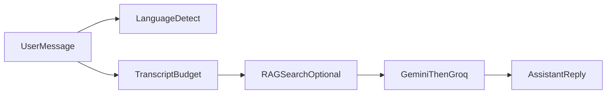

# Algorithms & behavior

This page describes **non-secret** logic that shapes product behavior. For file-level references, see the linked source modules.

## Chat reply language

Before RAG, the chat route runs **`prepareMultilingualChatTurn`** ([`src/lib/chat/multilingual-prep.ts`](src/lib/chat/multilingual-prep.ts)): one **LLM** call returns strict **JSON** (validated with **Zod**) containing an **IETF language tag** (BCP-47) for the user’s latest message, an **English retrieval query** for embedding over the English-only corpus, and an optional **human-readable language hint** for the answer model. On parse failure it falls back to **English** and the **raw** user text for retrieval.

The **final** model call is instructed to reply in that language while **retrieved passages** stay in English. Users may still mix languages in conversation; the latest turn drives detection.

## Transcript budgeting

Long conversations are trimmed with a **token budget heuristic** (character length ÷ 4) so prompts stay within model limits. Older turns may be summarized or dropped before the model call.

## Retrieval-augmented generation (RAG)

1. User (or server) issues a query relevant to medical knowledge.
2. A **multilingual prep** step produces an **English retrieval query** (any source language → concise English for semantic search).
3. **Embedding** via the configured Gemini embedding model.
4. **Vector search** in Postgres (`rag_chunks`) through a SQL RPC matcher.
5. Retrieved passages are injected into the system or tool context with citations-style provenance where implemented.

## LLM failover

Primary text generation uses **Google Gemini**. On failure or empty output, the server falls back to **Groq** (OpenAI-compatible API) with the same prompt envelope where possible.

## Nearby facilities (Bangladesh)

When the client passes approximate **coordinates** and the user intent matches nearby care, the server can inject **Bangladesh facility catalog** rows into chat context to ground facility answers.

## Community realtime (optional)

When Supabase **Realtime** publication includes community tables, the client may:

- Subscribe to `postgres_changes` for comments, likes, or posts.
- **Debounce** rapid bursts of events before refetching lists to avoid UI thrash.

Policies still apply: clients only receive events for rows they could read with their JWT.

## Notifications

Row inserts from community activity (for example new comments or likes) can enqueue **`notifications`** rows via database triggers. The bell UI merges REST polling with optional realtime subscriptions.

