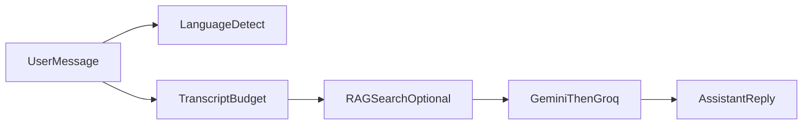

# Algorithms & behavior

This page describes **non-secret** logic that shapes product behavior. For file-level references, see the linked source modules.

## Chat reply language

The chat route inspects the latest user message:

1. **Unicode Bangla** range detection for native script.
2. **Banglish** heuristic: Latin tokens matched against a curated hint word set; requires multiple hits to reduce false positives.

If either matches, replies prefer **Bangla**; otherwise **English**. Users can still mix languages naturally.

## Transcript budgeting

Long conversations are trimmed with a **token budget heuristic** (character length ÷ 4) so prompts stay within model limits. Older turns may be summarized or dropped before the model call.

## Retrieval-augmented generation (RAG)

1. User (or server) issues a query relevant to medical knowledge.
2. Optional **English normalization** path for retrieval when the question is Roman-script Banglish.
3. **Embedding** via the configured Gemini embedding model.
4. **Vector search** in Postgres (`rag_chunks`) through a SQL RPC matcher.
5. Retrieved passages are injected into the system or tool context with citations-style provenance where implemented.

## LLM failover

Primary text generation uses **Google Gemini**. On failure or empty output, the server falls back to **Groq** (OpenAI-compatible API) with the same prompt envelope where possible.

## Nearby facilities (Bangladesh)

When the client passes approximate **coordinates** and the user intent matches nearby care, the server can inject **Bangladesh facility catalog** rows into chat context to ground facility answers.

## Community realtime (optional)

When Supabase **Realtime** publication includes community tables, the client may:

- Subscribe to `postgres_changes` for comments, likes, or posts.
- **Debounce** rapid bursts of events before refetching lists to avoid UI thrash.

Policies still apply: clients only receive events for rows they could read with their JWT.

## Notifications

Row inserts from community activity (for example new comments or likes) can enqueue **`notifications`** rows via database triggers. The bell UI merges REST polling with optional realtime subscriptions.

