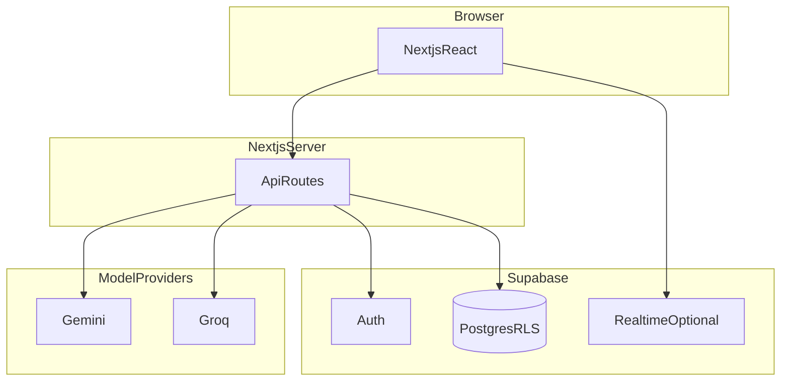

# Architecture (condensed)

MaaCare is a **Next.js (App Router)** application with a **Supabase** backend (Auth, Postgres + RLS, Storage, optional Realtime) and **server-side** calls to **Gemini** and **Groq** for AI.

## Request path

1. Browser hits Next.js (optionally through `proxy` for session refresh and route gating).
2. **Route Handlers** under `src/app/api` validate input (commonly **Zod**), load the user with `getSessionFromCookies`, then use `createSupabaseServerClient`.
3. Postgres enforces **RLS** per user; admin routes additionally check **admin role**.

## Major components

| Layer | Responsibility |
|-------|----------------|
| UI | React pages under `src/app`, shared shell components, community editor |
| API | REST-style JSON Route Handlers |
| Auth | Supabase Auth cookies; public `/api/auth/*` for login/session helpers |
| Data | Tables for profiles, pregnancy, vitals, symptoms, planner, community, notifications, RAG |
| AI | Chat orchestration, embeddings, RAG RPC, report pipelines |
| Storage | Avatars and community images (bucket policies in SQL migrations) |

## External services

- **Supabase** — system of record.
- **Google Gemini** — primary LLM and embeddings.
- **Groq** — failover LLM.

## Deeper diagrams

The repository file `docs/ARCHITECTURE.md` is the long-form architecture reference for contributors. Keep that file and this page aligned when you change major subsystems.

## Security notes

- **Service role** keys must never ship to the client.
- Public documentation does **not** grant API access; cookies are still required for protected routes.
