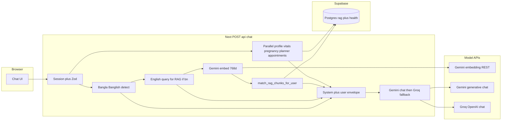
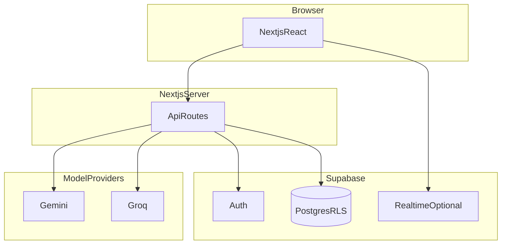

# Architecture (in-app summary)

MaaCare is **Next.js (App Router)** plus **Supabase** (Auth, Postgres + RLS, Storage, optional Realtime). **Gemini** and **Groq** are used **only on the server** from Route Handlers — keys never ship to the browser.

## End-to-end chat and RAG (one diagram)

## Multilingual and voice (short)

- **Reply language:** Unicode Bangla script or **Banglish** Latin-token hints choose **Bangla vs English** system instructions.
- **Retrieval:** Bangla user text is **translated to English** (same Gemini→Groq helper) **only** to embed and search RAG; the model still answers in the user’s language.
- **Voice:** Request field `replyChannel: "voice"` adds **spoken-style** rules (no markdown, short sentences), slightly **higher temperature**, and TTS-friendly copy. Browser capture/playback lives under `src/lib/voice/*`.

## Model defaults (env overrides)

| Role | Typical | Env |
|------|---------|-----|
| Chat | `gemini-2.5-flash` | `GEMINI_CHAT_MODEL` |
| Chat fallback | `llama-3.1-8b-instant` on Groq | `GROQ_CHAT_MODEL` |
| Embeddings | `text-embedding-004` (768-D) | `GEMINI_EMBEDDING_MODEL` |

## Request path and security

1. **`proxy`** refreshes Supabase cookies and gates routes.
2. APIs use **`getSessionFromCookies`** and **`createSupabaseServerClient`**; Postgres **RLS** enforces row access.
3. Admin UI and `/api/admin/*` require **admin** role.

## Full reference

The canonical, diagram-heavy document is **`docs/ARCHITECTURE.md`** in the repository (chat sequence, failover ladder, RAG ingest vs query, community, realtime, deployment). Update both when you change AI or data paths.

## Security notes

- **Service role** keys stay server-only.
- Public `/docs` does **not** bypass API authentication.
